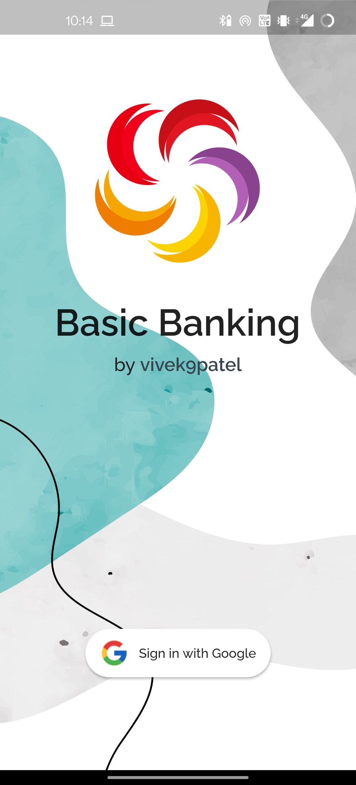
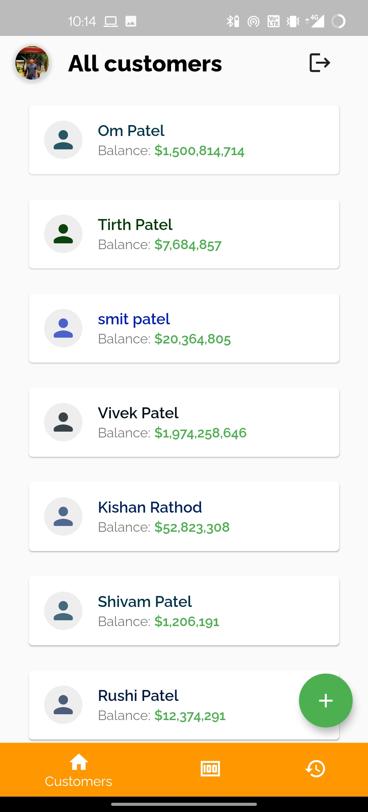
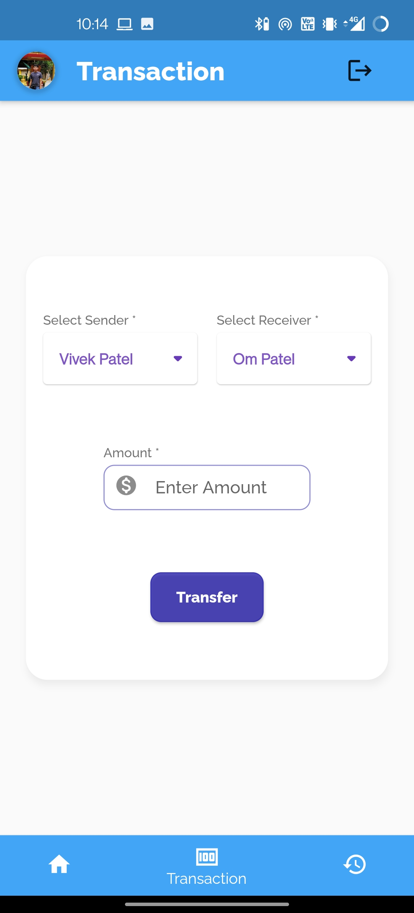
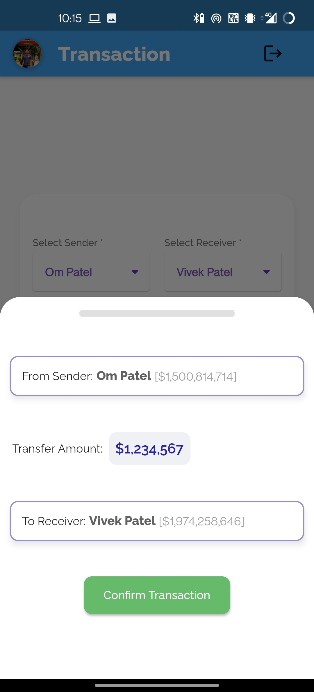
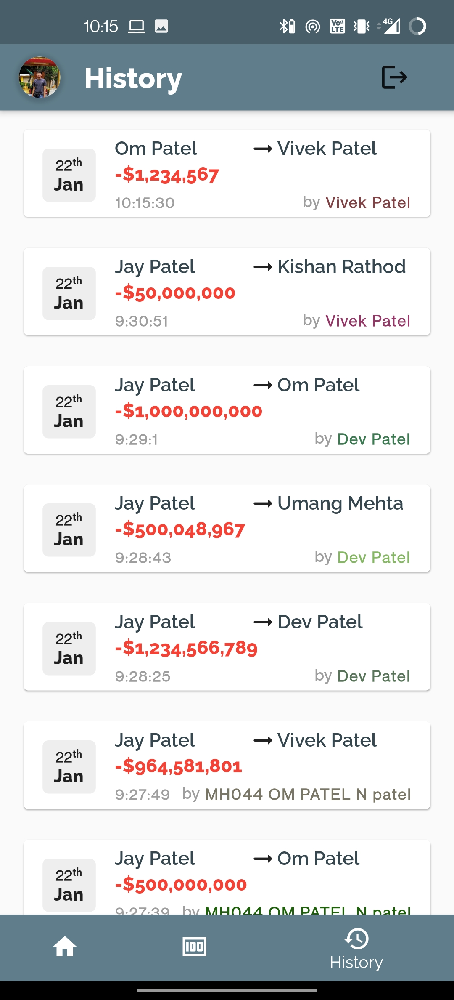

  

  <h3 align="center">Basic Banking Flutter App</h3>

  

    A Beginner Flutter Project with the integration of Firebase.
     
     
    <a target="_blank" href="https://github.com/vivek9patel/flutter-banking-app/issues">Report Bug</a>
    ·
    <a target="_blank" href="https://github.com/vivek9patel/flutter-banking-app/releases/download/1.0.0/app-release.apk">Install App</a>
  

<!-- TABLE OF CONTENTS -->

  
<h2 style="display: inline-block">Table of Contents</h2>

  <ol>
    <li>
      <a href="#about-the-project">About The Project</a>
      <ul>
        <li><a href="#built-with">Built With</a></li>
      </ul>
    </li>
    <li><a href="#demo">Demo</a></li>
    <li><a href="#contributing">Contributing</a></li>
    <li><a href="#contact">Contact</a></li>
  </ol>

<!-- ABOUT THE PROJECT -->

## About The Project

<h4>
This Project is created to learn Flutter and Firebase.Used for creating transactions between different Users and displaying the history of transactions done by different Google Users.
</h4>

### Features

- Sign in with Google Account
- Add Users to Database (Admin Only)
- Display all Customers with Account Balance
- Transact Amount between Customers from all Customers
- Display Transaction History and which User did the transaction
- Displaying Data with Firebase Stream (No Screen Refreshing!)

### Built With

- [Flutter](https://flutter.dev/)
- [Firebase Authentication](https://firebase.google.com/docs/auth)
- [Firestore Database](https://firebase.google.com/docs/firestore)

## Demo

- Here are some Screen shots of different Screens of this Flutter APP
   
  
  
  
  
  

## Contributing

Contributions are what make the open source community such an amazing place to be learn, inspire, and create. Any contributiors who wants to get into Flutter or App development can make contribution,which will be **greatly appreciated**.

1. Fork the Project
2. Create your Feature Branch (`git checkout -b feature/AmazingFeature`)
3. Commit your Changes (`git commit -m 'Added some AmazingFeature'`)
4. Push to the Branch (`git push origin feature/AmazingFeature`)
5. Open a Pull Request

## Contact

Vivek Patel - [@vivek9patel-linkedlin](https://www.linkedin.com/in/vivek9patel/) | vivek.p9737@gmail.com

Project Link: [https://github.com/vivek9patel/flutter-banking-app](https://github.com/vivek9patel/flutter-banking-app)
